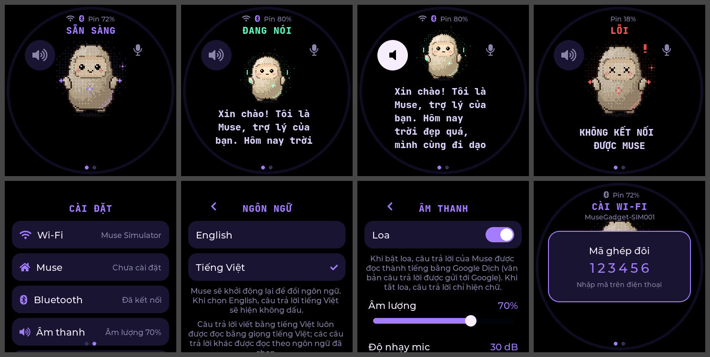
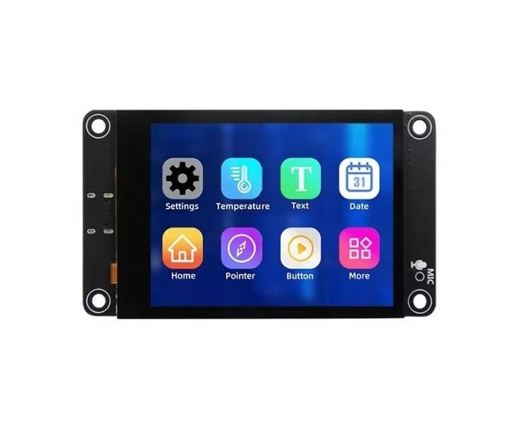
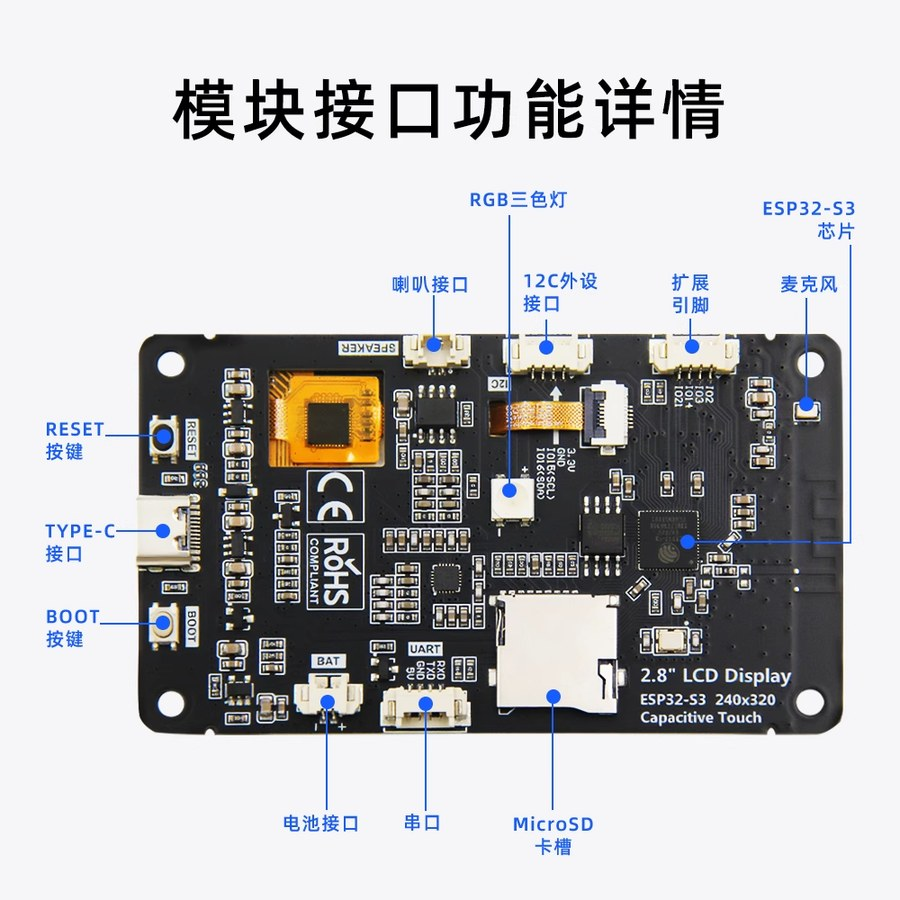
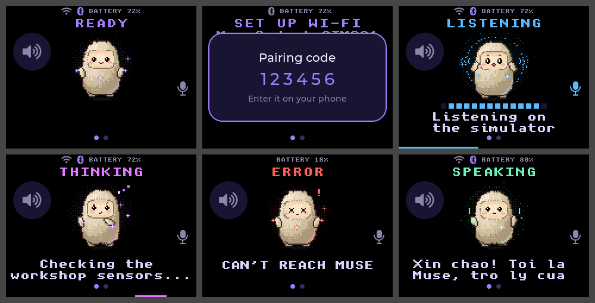
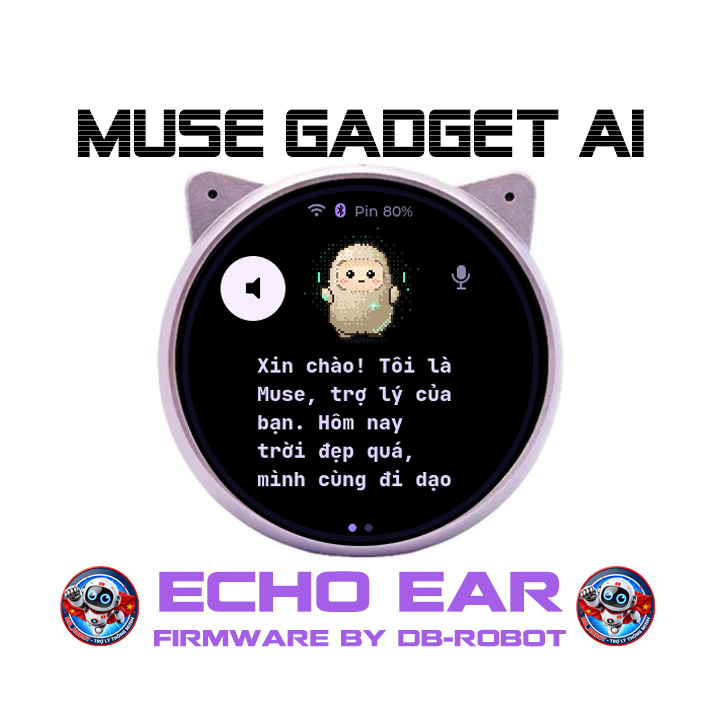
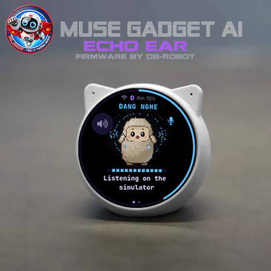
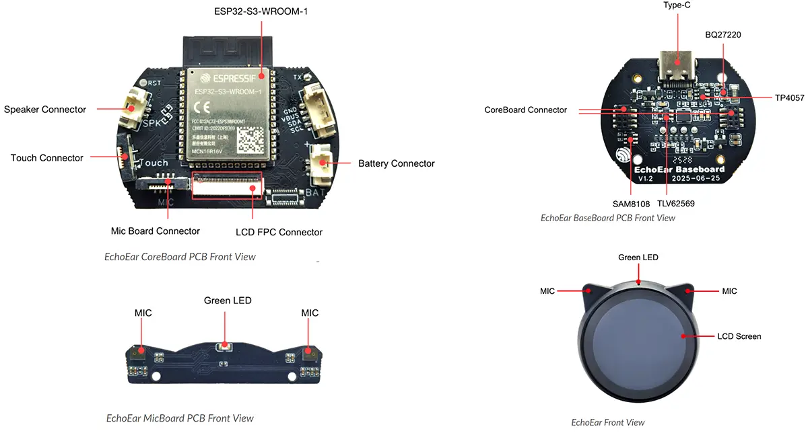
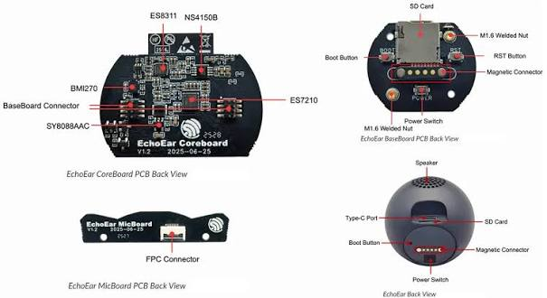
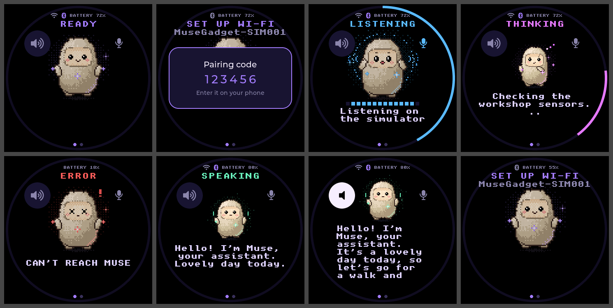

<!--
Copyright (c) Meta Platforms, Inc. and affiliates.

Licensed under the Apache License, Version 2.0 (the "License");
you may not use this file except in compliance with the License.
You may obtain a copy of the License at

    http://www.apache.org/licenses/LICENSE-2.0

Unless required by applicable law or agreed to in writing, software
distributed under the License is distributed on an "AS IS" BASIS,
WITHOUT WARRANTIES OR CONDITIONS OF ANY KIND, either express or implied.
See the License for the specific language governing permissions and
limitations under the License.
-->
<!-- Modified by ledienbien-ai (2026): describes this fork and the ESP32-S3 boards it adds. -->

<p align="center">
  <a href="https://dbrobot.vn/"></a>
</p>
<p align="center">
  Developer: <b>ledienbien-ai</b> · Homepage: <a href="https://dbrobot.vn/">https://dbrobot.vn/</a>
</p>

# Muse Gadgets for the ESP32-S3 Device

**English** | [Tiếng Việt](README.vi.md) | [简体中文](README.zh-CN.md) | [日本語](README.ja.md) | [한국어](README.ko.md)

> An unofficial community fork of
> [facebookincubator/muse-gadget-sdk](https://github.com/facebookincubator/muse-gadget-sdk).
> It is not affiliated with or endorsed by Meta, Waveshare or any other board
> maker.

<p align="center">
  <picture>
    <source media="(prefers-color-scheme: dark)" srcset=".github/images/muse-gadgets-dark.png">
    
  </picture>
</p>

Muse gadgets are open source devices you build yourself: program an
off-the-shelf ESP32 board or set up a Raspberry Pi, then connect Muse to your
displays, buttons, sensors and actuators. This fork adds ESP32-S3 boards that
the upstream ESP32 Device SDK doesn't support yet, and leaves the rest of the
SDK as it is upstream.

Built by hackers, for hackers, just for fun. Flashing custom firmware can brick
boards and void warranties. Proceed at your own risk!

## Boards in this fork

Each board runs the full on-screen UI: the animated avatar, push-to-talk,
settings by touch, and images from Muse.

| Board | Screen | Name | Profile | Status |
|---|---|---|---|---|
| [Waveshare ESP32-S3-Touch-LCD-1.85C](#waveshare-esp32-s3-touch-lcd-185c) | 1.85" round 360×360, touch | `s3lcd` | `waveshare-s3-185c` | Flash the firmware online at: https://dbrobot.vn/firmware.html |
| [OSTB-3ST](#ostb-3st) | 1.83" 296×240, touch | `ostb` | `ostb-3st` | Flash the firmware online at: https://dbrobot.vn/firmware.html |
| [LCDWIKI 2.8inch ESP32-S3 Display](#lcdwiki-28inch-esp32-s3-display) | 2.8" 320×240, touch on the ES3C28P | `lcd28` | `lcdwiki-s3-28` | Flash the firmware online at: https://dbrobot.vn/firmware.html |
| [Espressif EchoEar](#espressif-echoear) | 1.85" round 360×360, touch | `echoear` | `echoear` | Flash the firmware online at: https://dbrobot.vn/firmware.html |

The name is what `tools/muse/board.sh` calls the board; the profile names its
build settings and build directory. The boards upstream supports are still
here, listed in [`esp32/devices/README.md`](esp32/devices/README.md).

## Vietnamese screen and spoken replies

The boards above add two things to the on-screen UI.

<p align="center">
  
</p>

**A screen in Vietnamese or English.** The boards start in Vietnamese. Swipe
left from Muse and open **Settings > Language** (Cài đặt > Ngôn ngữ) to pick
**English** or **Tiếng Việt**; Muse restarts into it and keeps the choice. On
a board without touch, send `>lang=en` or `>lang=vi` on the serial console, or
pick it on [`esp32/tools/muse/ble_setup.html`](esp32/tools/muse/ble_setup.html).
In Vietnamese, replies and the words you spoke are shown with their accents. In
English they're shown without them, since the English fonts have none.

**Replies read aloud.** Muse answers gadgets in text. With the speaker on, the
board sends each reply to Google Translate's text-to-speech and plays what
comes back while the captions follow it: in a Vietnamese voice when the reply
is written in Vietnamese, otherwise in the voice of the screen's language. With
the speaker off (hold the speaker button on the face, or Settings > Sound),
replies are shown as text and nothing is sent.

> The voice comes from the address behind the "listen" button of Google
> Translate. It needs no key, but it isn't a published service: Google can
> change, limit or block it at any time, and the text of every spoken reply
> goes to Google. When it doesn't answer, the reply is shown as text, as before.
> Build with `CONFIG_MUSE_TTS_GOOGLE=n` to leave it out, or put a service of
> your own in [`muse_tts.c`](esp32/components/muse/muse_tts.c).
> `CONFIG_MUSE_LANG_DEFAULT_VI=n` makes a board start in English.

**Status:** builds with ESP-IDF v6.0.1. The screens are checked in the
simulator in both languages, and the speech address answers with MP3 from a PC.
Not run on a real board yet.

Code: [`muse_lang.c`](esp32/components/muse/muse_lang.c) (the texts),
[`muse_fonts.c`](esp32/components/muse/muse_fonts.c) and
[`fonts/`](esp32/components/muse/fonts) (Vietnamese letters),
[`muse_tts.c`](esp32/components/muse/muse_tts.c) and
[`muse_tts_text.c`](esp32/components/muse/muse_tts_text.c) (speech).

## Waveshare ESP32-S3-Touch-LCD-1.85C

<p align="center">
  
  
</p>
<p align="center">
  
</p>

| Part | Details |
|---|---|
| Chip | ESP32-S3R8, 16 MB flash, 8 MB octal PSRAM, native USB |
| Display | 1.85" round 360×360 ST77916 LCD on QSPI, PWM backlight |
| Touch | CST816 |
| Audio, V1 board | PCM5101 DAC and a digital I2S microphone |
| Audio, V2 board ("Rev2.0") | ES8311 DAC and ES7210 ADC with two microphones |
| Button | BOOT: hold to talk |
| Battery | Voltage through a divider on GPIO8 |

One firmware serves both audio versions: it checks for the ES8311 at boot.

**Status:** builds with ESP-IDF v6.0.1 and has been flashed on a board, where
it boots and shows the UI. Talking to Muse hasn't been tried on it yet, and the
V2 audio path is written from Waveshare's example code without a V2 board to
try it on.

Known limits: BOOT is the only button, so the screen sleeps on its timer and
powering off is on the Power page in Settings (the board deep-sleeps until BOOT
is pressed; the slide switch cuts power). The charger's status reaches no pin,
so the board shows "charging" only while a computer is attached.

Code: [`board_waveshare_s3_185c.c`](esp32/components/muse/boards/board_waveshare_s3_185c.c),
build settings: [`sdkconfig.muse-waveshare-s3-185c`](esp32/devices/sdkconfig.muse-waveshare-s3-185c).
Hardware reference: [Waveshare's documentation](https://docs.waveshare.com/ESP32-S3-Touch-LCD-1.85C).

## OSTB-3ST

<p align="center">
  
</p>
<p align="center">
  
</p>
<p align="center">
  
</p>

Ported from the source of the board's xiaozhi-esp32 firmware
(`ostb-xiaozhi-3st`). The UI is laid out for its 296×240 landscape screen.

| Part | Details |
|---|---|
| Chip | ESP32-S3, 16 MB flash, 8 MB octal PSRAM, native USB |
| Display | 1.83" 240×296 NV3023 LCD on SPI, used in landscape, PWM backlight |
| Touch | CST816, read by polling: it has no interrupt line |
| Audio | ES8311 DAC and ES7210 ADC |
| Keys | On the top edge. **+** (volume up): hold to talk. **−** (volume down): press to sleep the screen, hold to power off. The key between them isn't used |
| Battery | Level from the firmware's ADC table, and the charger's status pin |

**Status:** builds with ESP-IDF v6.0.1. It has not been run on the board. The
pins, the panel's setup and its orientation come from that firmware's source,
with no documentation to check them against. If the picture comes out rotated
or mirrored, or touches land in the wrong place, change `LCD_MADCTL` or
`TP_SWAP_XY`, `TP_MIRROR_X` and `TP_MIRROR_Y` at the top of the board's code.

Known limits: the 4G modem and the LED aren't used. The battery shows a level
but no voltage. Powering off drives the board's power-off pin; on USB power the
board may stay up, with the screen off until the + key is pressed. Once
the battery is full, the board knows it's on USB power only while a computer
is attached.

Code: [`board_ostb_3st.c`](esp32/components/muse/boards/board_ostb_3st.c),
build settings: [`sdkconfig.muse-ostb-3st`](esp32/devices/sdkconfig.muse-ostb-3st).

## LCDWIKI 2.8inch ESP32-S3 Display

<p align="center">
  
  
</p>
<p align="center">
  
</p>

A 2.8" display board sold under many names. LCDWIKI makes two models: the
**ES3C28P** with a capacitive touch panel and the **ES3N28P** without. One
firmware serves both: it looks for the touch controller at boot.

| Part | Details |
|---|---|
| Chip | ESP32-S3R8, 16 MB flash, 8 MB octal PSRAM, native USB |
| Display | 2.8" 240×320 ILI9341V LCD on SPI at 40 MHz, used in landscape, PWM backlight |
| Touch | FT6336G on the ES3C28P; none on the ES3N28P |
| Audio | ES8311 codec with one microphone, FM8002E speaker amp |
| Button | BOOT: hold to talk |
| Battery | Level from the board firmware's ADC range, on GPIO9 |

**Status:** builds with ESP-IDF v6.0.1. It has not been run on the board. The
pins come from [LCDWIKI's page](https://www.lcdwiki.com/2.8inch_ESP32-S3_Display) and the board's xiaozhi-esp32 files; the
touch panel's orientation and the 40 MHz SPI limit are as measured on the
board in [esphome-es3c28p-light-panel](https://github.com/jvduuren/esphome-es3c28p-light-panel). If touches land in the wrong
place, change `TP_SWAP_XY`, `TP_MIRROR_X` and `TP_MIRROR_Y` at the top of the
board's code.

Known limits: BOOT is the only button, so the screen sleeps on its timer and
powering off is on the Power page in Settings (the board deep-sleeps until BOOT
is pressed). On the ES3N28P, with no touch and one button, there are no
settings on the device: it does push-to-talk and is set up from the Muse app.
The battery shows a level but no voltage, and the charger's status reaches no
pin, so the board shows "charging" only while a computer is attached. The SD
card slot and the RGB LED aren't used.

Code: [`board_lcdwiki_s3_28.c`](esp32/components/muse/boards/board_lcdwiki_s3_28.c),
build settings: [`sdkconfig.muse-lcdwiki-s3-28`](esp32/devices/sdkconfig.muse-lcdwiki-s3-28).

## Espressif EchoEar

<p align="center">
  
  
</p>
<p align="center">
  
</p>
<p align="center">
  
</p>
<p align="center">
  
</p>

Espressif's cat-shaped voice kit, also sold as the ESP-VoCat. Two versions of
its board are around, v1.0 and v1.2, with a handful of pins moved between
them. One firmware serves both: it tells them apart at boot and logs which it
found.

| Part | Details |
|---|---|
| Chip | ESP32-S3-WROOM-1-N16R16VA on v1.2 (16 MB flash), ESP32-S3-WROOM-2-N32R16V on v1.0 (32 MB flash); 16 MB octal PSRAM, native USB |
| Display | 1.85" round 360×360 ST77916 LCD on QSPI, PWM backlight |
| Touch | CST816S |
| Audio | ES8311 codec, NS4150B speaker amp, ES7210 with two microphones (one is used) |
| Buttons | BOOT, on the back beside the magnetic connector, and the touch pads under the shell (two on v1.2, one on v1.0): hold either to talk |
| Battery | BQ27220 gauge: level, voltage and charging |

**Status:** builds with ESP-IDF v6.0.1. It has not been run on the board. The
v1.2 pins and the display, touch and codec setup are those of Espressif's own
[board support package](https://github.com/espressif/esp-bsp/tree/master/bsp/esp_vocat)
and of the board's xiaozhi-esp32 files; the v1.0 pins come from the xiaozhi
files alone, so v1.0 is the less certain of the two. The touch pads are set up
as Espressif's package sets them up, and count as touched when their reading
rises by 1.5 %; how far a hand moves it on a real board hasn't been measured,
so that figure (`PAD_THRESH` in the board file) may need changing. The log
gives each touch's reading.

Known limits: BOOT is the only key the firmware reads, so the screen sleeps
on its timer, and powering off on the Power page in Settings puts the board in
deep sleep until BOOT is pressed; the board's own power key is what cuts the
supply. A touch pad talks and wakes the screen as BOOT does, but it doesn't
confirm a pairing with the Muse app or end that deep sleep: those take BOOT. A
pad held for 20 seconds is taken to be covered, not touched, and is let go of.
The motion sensor, the SD card slot and the green LED aren't used. The gauge runs off the battery, so without
one there is no battery level. On a charger that isn't a computer, the board
shows "charging" only while current flows into the battery.

Code: [`board_echoear.c`](esp32/components/muse/boards/board_echoear.c),
build settings: [`sdkconfig.muse-echoear`](esp32/devices/sdkconfig.muse-echoear).

## Build and flash

The steps are the same for every board. Take its name and profile from the
[table above](#boards-in-this-fork).

1. Get an [SDK token](https://gadgets.muse.ai/settings/sdk-tokens) and read the
   [Gadget SDK Terms](https://gadgets.muse.ai/sdk-terms). Every gadget needs a
   token to pair.
2. Install ESP-IDF **v6.0.1** (see [`esp32/README.md`](esp32/README.md)).
3. Build from `esp32/`. On macOS or Linux, with the board's name:

   ```sh
   tools/muse/board.sh build ostb
   ```

   On Windows, in an ESP-IDF PowerShell, with the board's profile:

   ```powershell
   $P = "ostb-3st"
   idf.py -B build-muse-$P -DIDF_TARGET=esp32s3 `
     "-DSDKCONFIG=build-muse-$P/sdkconfig" `
     "-DSDKCONFIG_DEFAULTS=sdkconfig.defaults;devices/sdkconfig.muse;devices/sdkconfig.muse-$P" build
   ```

   Set the token with `idf.py -B build-muse-$P menuconfig`
   (ESP32 Device SDK > Muse Gadgets SDK token), then build again.
4. Flash over USB-C, replacing `PORT` with your board's port:

   ```powershell
   idf.py -B build-muse-$P -p PORT flash
   ```

   If it can't connect, put the board in download mode and try again: hold
   **BOOT**, tap **RESET**, release **BOOT**. On a board without a RESET
   button, hold BOOT while you plug the cable in.

   For a web flasher, make one file and write it at address `0x0`:

   ```powershell
   idf.py -B build-muse-$P merge-bin -o muse-gadget-$P-merged.bin
   ```

   A build made with your SDK token carries that token, so think before you
   publish the file.
5. In the Muse app, turn on **Settings > Devices > Developer mode**, add the
   device named `MuseGadget-XXXXXX`, and press the board's talk button when
   asked (BOOT on the 1.85C, the LCDWIKI board and the EchoEar, the + key on the
   OSTB-3ST).

## Adding another device

A board with a screen, a speaker and a microphone needs one driver file and a
few lines of registration. This is what each board in this fork consists of:

1. `esp32/components/muse/boards/board_<id>.c` fills in `muse_board_t`
   (`muse_board.h`): display, touch, audio, buttons, battery and power. Start
   from the board closest to yours.
2. `esp32/devices/sdkconfig.muse-<profile>` holds its build settings: chip,
   flash, PSRAM.
3. `esp32/components/muse/Kconfig`, `CMakeLists.txt` and `idf_component.yml`
   register it, with any driver component it needs.
4. `esp32/tools/muse/board.sh`, `ports.py` and `avatar.py` get its short name.
5. The documentation gets it too: a row and a section in each README, rows in
   [`esp32/devices/README.md`](esp32/devices/README.md), a picture in
   `doc/image/`, and its sources and their licenses in
   [`CREDITS.md`](CREDITS.md).

The UI fits itself to round and rectangular screens. The pictures above come
from the simulator in `esp32/simulator`, with the screen size in its
`src/sim_board.c` changed to the board's: a way to see a new size before the
board is in hand. [`esp32/devices/AGENTS.md`](esp32/devices/AGENTS.md) has the
full recipe, from gathering the board's facts to checking the result.

## The rest of the SDK

| | |
|---|---|
| [**ESP32 Device SDK**](esp32) | Connect your ESP32 board to Muse. Throw in a screen to show images, add audio in and out, or wire up other sensors. |
| [**Linux Device SDK**](linux) | Turn that spare Raspberry Pi or Linux box into a Muse gadget. Hack in your own commands to let Muse handle sysadmin chores or your Home Assistant setup. |

ESP32 and Linux gadgets pair with the Muse app on iOS and Android, via
Settings > Devices. Turn on Developer mode there first, then look for devices
prefixed with "MuseGadget". Each directory has a `README.md` to get started and
an `AGENTS.md` for coding agents.

## Community

The upstream project's community meets on
[Discord](https://discord.gg/3bhjCkZdd6). For the boards this fork adds, open
an issue on this repository.

## License and credits

- The Muse Gadget SDK is copyright Meta Platforms, Inc. and affiliates, under
  the Apache License, Version 2.0, in [`LICENSE`](LICENSE).
- The changes in this fork are copyright 2026 ledienbien-ai, under the same
  license.
- The 1.85C port draws on Waveshare's documentation and
  [example code](https://github.com/waveshareteam/ESP32-S3-Touch-LCD-1.85C)
  (Apache-2.0) and on
  [xiaozhi-esp32](https://github.com/78/xiaozhi-esp32)'s board for it (MIT).
- The OSTB-3ST port takes its pins, panel setup table and battery table from
  the board's xiaozhi-esp32 firmware source, which carries no license notice of
  its own; xiaozhi-esp32 is MIT.
- The LCDWIKI 2.8inch port draws on [LCDWIKI's page](https://www.lcdwiki.com/2.8inch_ESP32-S3_Display) for the board, on
  the board's xiaozhi-esp32 files, and on measurements published in
  [esphome-es3c28p-light-panel](https://github.com/jvduuren/esphome-es3c28p-light-panel); no code is copied from them.
- Two upstream files keep their own licenses: `minimp3.h` (CC0-1.0) and
  `pixel_font.c` (BSD-2-Clause). Components fetched at build time are under
  their own licenses.
- The DB_ROBOT startup logo is ledienbien-ai's and free to use, under the
  same license as the rest of this fork's changes.
- The Apache License does not cover the [Jollybot avatar](esp32/avatar), nor
  the Meta, Muse and Waveshare names and marks.

[`CREDITS.md`](CREDITS.md) has the full list: every source, its license, the
files this fork added or changed, and what to keep in order in later versions.
