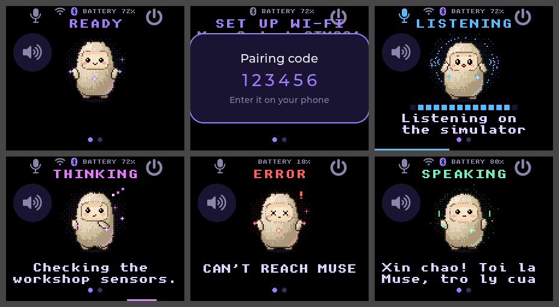
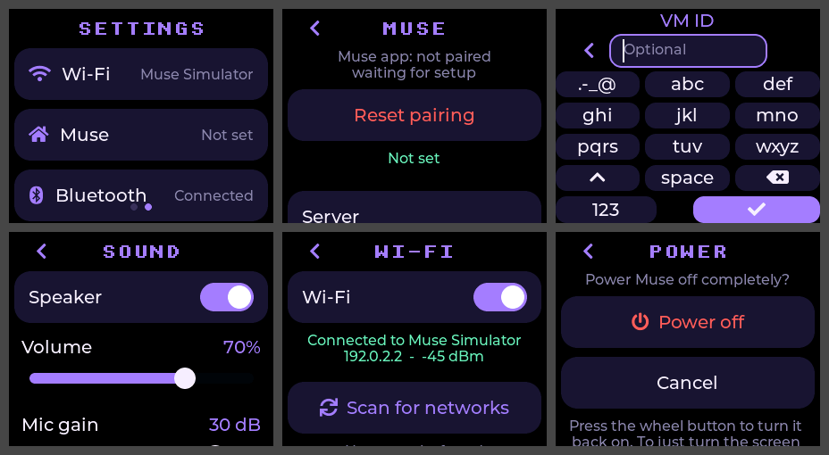
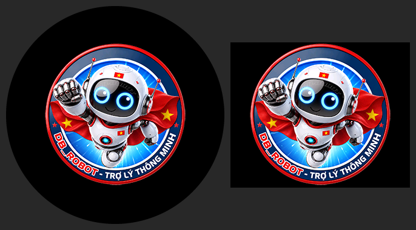

<!--
Copyright (c) Meta Platforms, Inc. and affiliates.
Copyright (c) 2026 ledienbien-ai (translation and fork-specific text)

Licensed under the Apache License, Version 2.0 (the "License");
you may not use this file except in compliance with the License.
You may obtain a copy of the License at

    http://www.apache.org/licenses/LICENSE-2.0

Unless required by applicable law or agreed to in writing, software
distributed under the License is distributed on an "AS IS" BASIS,
WITHOUT WARRANTIES OR CONDITIONS OF ANY KIND, either express or implied.
See the License for the specific language governing permissions and
limitations under the License.
-->

# Muse Gadgets cho thiết bị ESP32-S3

[English](README.md) | **Tiếng Việt** | [简体中文](README.zh-CN.md) | [日本語](README.ja.md) | [한국어](README.ko.md)

> Đây là bản fork không chính thức do cộng đồng thực hiện từ
> [facebookincubator/muse-gadget-sdk](https://github.com/facebookincubator/muse-gadget-sdk).
> Bản này không liên kết với Meta, Waveshare hay bất kỳ hãng làm bo nào, và
> không được các bên đó bảo trợ. Nếu bản dịch khác với
> [bản tiếng Anh](README.md), bản tiếng Anh là bản chuẩn.

<p align="center">
  <picture>
    <source media="(prefers-color-scheme: dark)" srcset=".github/images/muse-gadgets-dark.png">
    
  </picture>
</p>

Muse gadget là những thiết bị mã nguồn mở do bạn tự làm: nạp chương trình cho
một bo ESP32 có sẵn trên thị trường hoặc cài đặt một chiếc Raspberry Pi, rồi
kết nối Muse với màn hình, nút bấm, cảm biến và cơ cấu chấp hành của bạn. Bản
fork này thêm vào ESP32 Device SDK những bo ESP32-S3 mà bản gốc chưa hỗ trợ,
còn phần còn lại của SDK giữ nguyên như bản gốc.

Dự án do dân vọc vạch làm cho dân vọc vạch, chỉ để cho vui. Nạp firmware tùy
biến có thể làm hỏng bo và mất bảo hành. Bạn tự chịu rủi ro!

## Các bo trong bản fork này

Mỗi bo chạy đầy đủ giao diện trên màn hình: avatar động, nhấn giữ để nói, cài
đặt bằng cảm ứng và hiển thị ảnh do Muse gửi.

| Bo | Màn hình | Tên | Profile | Tình trạng |
|---|---|---|---|---|
| [Waveshare ESP32-S3-Touch-LCD-1.85C](#waveshare-esp32-s3-touch-lcd-185c) | Tròn 1,85" 360×360, cảm ứng | `s3lcd` | `waveshare-s3-185c` | Đã nạp lên bo thật: khởi động và hiện giao diện. Chưa thử trò chuyện với Muse |
| [OSTB-3ST](#ostb-3st) | 1,83" 296×240, cảm ứng | `ostb` | `ostb-3st` | Biên dịch được; chưa chạy trên bo thật |

Tên là cách `tools/muse/board.sh` gọi bo; profile là tên của cấu hình build và
thư mục build. Các bo mà bản gốc hỗ trợ vẫn còn nguyên, liệt kê trong
[`esp32/devices/README.md`](esp32/devices/README.md) (tiếng Anh).

## Waveshare ESP32-S3-Touch-LCD-1.85C

<p align="center">
  
</p>

| Thành phần | Chi tiết |
|---|---|
| Chip | ESP32-S3R8, flash 16 MB, PSRAM octal 8 MB, USB gốc |
| Màn hình | LCD tròn 1,85" 360×360 ST77916 qua QSPI, đèn nền PWM |
| Cảm ứng | CST816 |
| Âm thanh, bo V1 | DAC PCM5101 và micro số I2S |
| Âm thanh, bo V2 ("Rev2.0") | DAC ES8311 và ADC ES7210 với hai micro |
| Nút | BOOT: nhấn giữ để nói |
| Pin | Đo điện áp qua cầu chia trên GPIO8 |

Một firmware dùng cho cả hai phiên bản âm thanh: lúc khởi động nó dò xem có
ES8311 hay không.

**Tình trạng:** biên dịch được với ESP-IDF v6.0.1 và đã nạp lên bo thật: bo
khởi động và hiện giao diện. Chưa thử trò chuyện với Muse trên bo này, và đường
âm thanh V2 được viết theo mã mẫu của Waveshare khi chưa có bo V2 để thử.

Giới hạn đã biết: BOOT là nút duy nhất, nên màn hình tự tắt theo hẹn giờ và
việc tắt máy nằm ở trang Power trong Settings (bo vào deep sleep cho tới khi
nhấn BOOT; công tắc trượt mới ngắt nguồn). Trạng thái của mạch sạc không nối về
chân nào, nên bo chỉ báo "đang sạc" khi đang cắm vào máy tính.

Mã của bo: [`board_waveshare_s3_185c.c`](esp32/components/muse/boards/board_waveshare_s3_185c.c),
cấu hình build: [`sdkconfig.muse-waveshare-s3-185c`](esp32/devices/sdkconfig.muse-waveshare-s3-185c).
Tài liệu phần cứng: [trang của Waveshare](https://docs.waveshare.com/ESP32-S3-Touch-LCD-1.85C).

## OSTB-3ST

<p align="center">
  
</p>
<p align="center">
  
</p>

Port từ mã nguồn firmware xiaozhi-esp32 của chính bo này (`ostb-xiaozhi-3st`).
Giao diện được bố trí cho màn ngang 296×240.

| Thành phần | Chi tiết |
|---|---|
| Chip | ESP32-S3, flash 16 MB, PSRAM octal 8 MB, USB gốc |
| Màn hình | LCD NV3023 1,83" 240×296 qua SPI, dùng theo chiều ngang, đèn nền PWM |
| Cảm ứng | CST816, đọc bằng cách hỏi liên tục vì không có chân ngắt |
| Âm thanh | DAC ES8311 và ADC ES7210 |
| Phím | Phím trên (tăng âm lượng): giữ để nói. Phím dưới (giảm âm lượng): bấm để tắt màn hình, giữ để tắt nguồn |
| Pin | Mức pin theo bảng ADC của firmware gốc, và chân trạng thái của mạch sạc |

**Tình trạng:** biên dịch được với ESP-IDF v6.0.1. Chưa chạy trên bo thật.
Chân, bảng khởi tạo và hướng của màn hình lấy từ mã nguồn firmware đó, không có
tài liệu nào để đối chiếu. Nếu hình bị xoay hay lật, hoặc cảm ứng lệch chỗ, hãy
sửa `LCD_MADCTL` hoặc `TP_SWAP_XY`, `TP_MIRROR_X` và `TP_MIRROR_Y` ở đầu file
mã của bo.

Giới hạn đã biết: modem 4G và đèn LED không được dùng. Pin chỉ hiện mức, không
hiện điện áp. Tắt nguồn là kéo chân tắt nguồn của bo; khi cắm USB bo có thể vẫn
chạy, màn hình tắt cho đến khi bấm phím trên. Khi pin đã đầy, bo chỉ biết mình
đang cắm USB lúc được nối với máy tính.

Mã của bo: [`board_ostb_3st.c`](esp32/components/muse/boards/board_ostb_3st.c),
cấu hình build: [`sdkconfig.muse-ostb-3st`](esp32/devices/sdkconfig.muse-ostb-3st).

## Biên dịch và nạp

Các bước giống nhau cho mọi bo. Lấy tên và profile của bo ở
[bảng phía trên](#các-bo-trong-bản-fork-này).

1. Lấy [SDK token](https://gadgets.muse.ai/settings/sdk-tokens) và đọc
   [Điều khoản Gadget SDK](https://gadgets.muse.ai/sdk-terms). Gadget nào cũng
   cần token mới ghép đôi được.
2. Cài ESP-IDF **v6.0.1** (xem [`esp32/README.md`](esp32/README.md)).
3. Biên dịch từ thư mục `esp32/`. Trên macOS hoặc Linux, dùng tên của bo:

   ```sh
   tools/muse/board.sh build ostb
   ```

   Trên Windows, trong ESP-IDF PowerShell, dùng profile của bo:

   ```powershell
   $P = "ostb-3st"
   idf.py -B build-muse-$P -DIDF_TARGET=esp32s3 `
     "-DSDKCONFIG=build-muse-$P/sdkconfig" `
     "-DSDKCONFIG_DEFAULTS=sdkconfig.defaults;devices/sdkconfig.muse;devices/sdkconfig.muse-$P" build
   ```

   Đặt token bằng `idf.py -B build-muse-$P menuconfig`
   (ESP32 Device SDK > Muse Gadgets SDK token), rồi biên dịch lại.
4. Nạp qua USB-C, thay `PORT` bằng cổng của bo:

   ```powershell
   idf.py -B build-muse-$P -p PORT flash
   ```

   Nếu không kết nối được, đưa bo vào chế độ nạp rồi thử lại: giữ **BOOT**,
   nhấn **RESET**, thả **BOOT**. Với bo không có nút RESET, giữ BOOT trong lúc
   cắm cáp.

   Để nạp qua web, tạo một file duy nhất và ghi ở địa chỉ `0x0`:

   ```powershell
   idf.py -B build-muse-$P merge-bin -o muse-gadget-$P-merged.bin
   ```

   Bản build có SDK token của bạn sẽ mang theo token đó, nên hãy cân nhắc trước
   khi đăng file công khai.
5. Trong ứng dụng Muse, bật **Settings > Devices > Developer mode**, thêm thiết
   bị tên `MuseGadget-XXXXXX`, rồi nhấn nút nói của bo khi được hỏi (BOOT trên
   bo 1.85C, phím trên của bo OSTB-3ST).

## Logo khởi động

<p align="center">
  
</p>

Mọi bo có giao diện đầy đủ đều hiện logo trong 2,5 giây khi khởi động, rồi mới
tới màn hình thường lệ. Logo là file
[`esp32/components/muse/logo/logo.c`](esp32/components/muse/logo), một ảnh
240×240 có nền trong suốt, đúng dạng mà
[công cụ chuyển ảnh của LVGL](https://lvgl.io/tools/imageconverter) xuất ra:
định dạng màu RGB565A8, tên `logo`. Muốn dùng logo của riêng bạn, hãy thay file
đó bằng một bản xuất mới cùng tên. Ảnh lớn hơn màn hình sẽ được thu nhỏ cho
vừa; ảnh nhỏ hơn thì giữ nguyên kích thước.

`idf.py -B build-muse-$P menuconfig` (Component config > Muse > Show a logo
while starting up) dùng để tắt logo hoặc đổi thời gian hiển thị.

## Thêm một thiết bị khác

Một bo có màn hình, loa và micro cần một file driver và vài dòng đăng ký. Mỗi
bo trong bản fork này gồm những phần sau:

1. `esp32/components/muse/boards/board_<id>.c` điền vào `muse_board_t`
   (`muse_board.h`): màn hình, cảm ứng, âm thanh, nút, pin và nguồn. Hãy bắt
   đầu từ bo giống bo của bạn nhất.
2. `esp32/devices/sdkconfig.muse-<profile>` chứa cấu hình build: chip, flash,
   PSRAM.
3. `esp32/components/muse/Kconfig`, `CMakeLists.txt` và `idf_component.yml`
   đăng ký bo, kèm component driver nếu cần.
4. `esp32/tools/muse/board.sh`, `ports.py` và `avatar.py` thêm tên ngắn của bo.
5. Tài liệu cũng cần cập nhật: một dòng trong bảng và một mục trong từng
   README, các dòng trong [`esp32/devices/README.md`](esp32/devices/README.md),
   một ảnh trong `doc/image/`, và nguồn tham khảo cùng giấy phép của chúng
   trong [`CREDITS.md`](CREDITS.md).

Giao diện tự co giãn theo màn tròn và màn chữ nhật. Các ảnh ở trên lấy từ trình
mô phỏng trong `esp32/simulator`, sau khi đổi kích thước màn hình trong
`src/sim_board.c` của nó thành kích thước của bo: cách này cho xem trước một
kích thước mới khi chưa có bo trong tay.
[`esp32/devices/AGENTS.md`](esp32/devices/AGENTS.md) (tiếng Anh) có hướng dẫn
đầy đủ, từ thu thập thông tin của bo đến kiểm tra kết quả.

## Phần còn lại của SDK

| | |
|---|---|
| [**ESP32 Device SDK**](esp32) | Kết nối bo ESP32 của bạn với Muse. Gắn thêm màn hình để hiện ảnh, thêm âm thanh vào ra, hoặc nối các cảm biến khác. |
| [**Linux Device SDK**](linux) | Biến chiếc Raspberry Pi hay máy Linux để không thành một Muse gadget. Tự thêm lệnh của bạn để Muse lo việc quản trị hệ thống hoặc hệ Home Assistant. |

Gadget ESP32 và Linux ghép đôi với ứng dụng Muse trên iOS và Android, trong
Settings > Devices. Bật Developer mode ở đó trước, rồi tìm thiết bị có tên bắt
đầu bằng "MuseGadget". Mỗi thư mục có một `README.md` để bắt đầu và một
`AGENTS.md` dành cho các trợ lý lập trình (đều bằng tiếng Anh).

## Cộng đồng

Cộng đồng của dự án gốc trao đổi trên
[Discord](https://discord.gg/3bhjCkZdd6). Với các bo do bản fork này thêm vào,
hãy mở issue trên repo này.

## Giấy phép và ghi công

- Muse Gadget SDK thuộc bản quyền của Meta Platforms, Inc. và các công ty liên
  kết, phát hành theo Giấy phép Apache, Phiên bản 2.0, trong
  [`LICENSE`](LICENSE).
- Các thay đổi trong bản fork này thuộc bản quyền 2026 của ledienbien-ai, theo
  cùng giấy phép đó.
- Bản port 1.85C dựa trên tài liệu và
  [mã mẫu](https://github.com/waveshareteam/ESP32-S3-Touch-LCD-1.85C) của
  Waveshare (Apache-2.0) và trên phần board tương ứng của
  [xiaozhi-esp32](https://github.com/78/xiaozhi-esp32) (MIT).
- Bản port OSTB-3ST lấy chân, bảng khởi tạo màn hình và bảng pin từ mã nguồn
  firmware xiaozhi-esp32 của bo, vốn không ghi giấy phép riêng; xiaozhi-esp32
  theo giấy phép MIT.
- Hai file của bản gốc giữ giấy phép riêng: `minimp3.h` (CC0-1.0) và
  `pixel_font.c` (BSD-2-Clause). Các component tải về lúc build theo giấy phép
  của chính chúng.
- Giấy phép Apache không bao gồm [avatar Jollybot](esp32/avatar), logo khởi
  động DB_ROBOT, cũng như tên và nhãn hiệu Meta, Muse và Waveshare.

[`CREDITS.md`](CREDITS.md) (tiếng Anh) có danh sách đầy đủ: từng nguồn, giấy
phép của nguồn đó, các file bản fork này thêm hoặc sửa, và những việc cần giữ
đúng ở các phiên bản sau.
