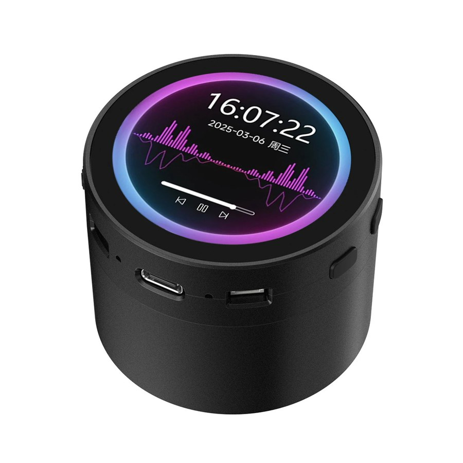
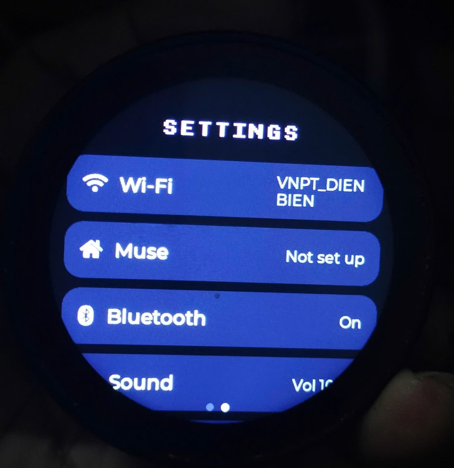
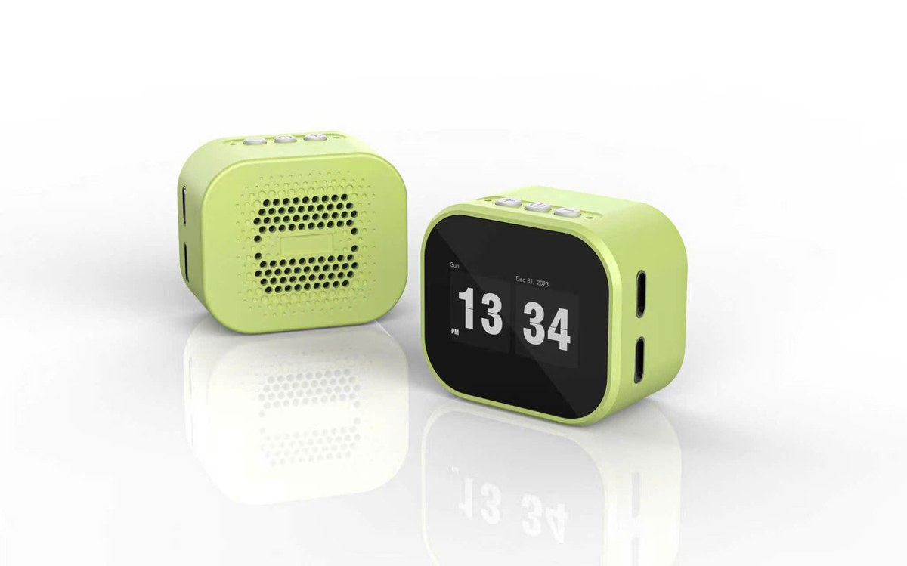

<!--
Copyright (c) Meta Platforms, Inc. and affiliates.
Copyright (c) 2026 ledienbien-ai (translation and fork-specific text)

Licensed under the Apache License, Version 2.0 (the "License");
you may not use this file except in compliance with the License.
You may obtain a copy of the License at

    http://www.apache.org/licenses/LICENSE-2.0

Unless required by applicable law or agreed to in writing, software
distributed under the License is distributed on an "AS IS" BASIS,
WITHOUT WARRANTIES OR CONDITIONS OF ANY KIND, either express or implied.
See the License for the specific language governing permissions and
limitations under the License.
-->

# 适用于 ESP32-S3 设备的 Muse Gadgets

[English](README.md) | [Tiếng Việt](README.vi.md) | **简体中文** | [日本語](README.ja.md) | [한국어](README.ko.md)

> 这是 [facebookincubator/muse-gadget-sdk](https://github.com/facebookincubator/muse-gadget-sdk)
> 的非官方社区分支，与 Meta、Waveshare（微雪）及其他任何开发板厂商都没有关联，
> 也未获得它们的认可。译文与[英文版](README.md)不一致时，以英文版为准。

<p align="center">
  <picture>
    <source media="(prefers-color-scheme: dark)" srcset=".github/images/muse-gadgets-dark.png">
    
  </picture>
</p>

Muse gadget 是可以自己动手制作的开源设备：给市面上现成的 ESP32 开发板烧录程序，
或者配置一台树莓派，然后把 Muse 接到你的屏幕、按键、传感器和执行器上。本分支为
ESP32 Device SDK 增加上游尚未支持的 ESP32-S3 开发板，SDK 的其余部分与上游保持
一致。

这是极客为极客做的项目，纯属好玩。烧录自定义固件可能让开发板变砖并失去保修，
风险自负！

## 本分支中的开发板

每块板子都运行完整的屏幕界面：动态头像、按住说话、触摸设置，以及显示 Muse 发来
的图片。

| 开发板 | 屏幕 | 名称 | Profile | 状态 |
|---|---|---|---|---|
| [Waveshare ESP32-S3-Touch-LCD-1.85C](#waveshare-esp32-s3-touch-lcd-185c) | 1.85 英寸圆形 360×360，触摸 | `s3lcd` | `waveshare-s3-185c` | 在线烧录固件：https://dbrobot.vn/firmware.html |
| [OSTB-3ST](#ostb-3st) | 1.83 英寸 296×240，触摸 | `ostb` | `ostb-3st` | 在线烧录固件：https://dbrobot.vn/firmware.html |

名称是 `tools/muse/board.sh` 对开发板的叫法；profile 是它的编译配置和编译目录的
名字。上游支持的开发板仍然保留，见
[`esp32/devices/README.md`](esp32/devices/README.md)（英文）。

## Waveshare ESP32-S3-Touch-LCD-1.85C

<p align="center">
  
  
</p>
<p align="center">
  
</p>

| 部分 | 说明 |
|---|---|
| 芯片 | ESP32-S3R8，16 MB flash，8 MB 八线 PSRAM，原生 USB |
| 屏幕 | 1.85 英寸圆形 360×360 ST77916 LCD，QSPI 接口，PWM 背光 |
| 触摸 | CST816 |
| 音频（V1 板） | PCM5101 DAC 和数字 I2S 麦克风 |
| 音频（V2 板，“Rev2.0”） | ES8311 DAC 和 ES7210 ADC，双麦克风 |
| 按键 | BOOT：按住说话 |
| 电池 | 通过 GPIO8 上的分压电路测量电压 |

同一个固件支持两种音频版本：启动时会检测是否存在 ES8311。

**状态：** 可以用 ESP-IDF v6.0.1 编译通过，并已烧录到实物上：能启动并显示界面。
尚未在这块板子上试过与 Muse 对话；V2 音频部分是参照 Waveshare 的示例代码编写的，
没有 V2 板可供测试。

已知限制：BOOT 是唯一的按键，所以屏幕按定时器熄屏，关机在 Settings 的 Power
页面里（开发板进入深度睡眠，按 BOOT 唤醒；真正断电要用拨动开关）。充电芯片的状态
没有接到任何引脚，所以只有连接电脑时才会显示“充电中”。

代码：[`board_waveshare_s3_185c.c`](esp32/components/muse/boards/board_waveshare_s3_185c.c)，
编译配置：[`sdkconfig.muse-waveshare-s3-185c`](esp32/devices/sdkconfig.muse-waveshare-s3-185c)。
硬件资料：[Waveshare 文档](https://docs.waveshare.com/ESP32-S3-Touch-LCD-1.85C)。

## OSTB-3ST

<p align="center">
  
</p>
<p align="center">
  
</p>
<p align="center">
  
</p>

根据这块开发板自带的 xiaozhi-esp32 固件源码（`ostb-xiaozhi-3st`）移植。界面按
296×240 的横屏排版。

| 部件 | 说明 |
|---|---|
| 芯片 | ESP32-S3，16 MB flash，8 MB 八线 PSRAM，原生 USB |
| 屏幕 | 1.83 英寸 240×296 NV3023 LCD，SPI 接口，横屏使用，PWM 背光 |
| 触摸 | CST816，没有中断引脚，靠轮询读取 |
| 音频 | ES8311 DAC 和 ES7210 ADC |
| 按键 | 位于顶部。**+**（音量加）：按住说话。**−**（音量减）：短按息屏，长按关机。中间的按键没有用到 |
| 电池 | 按原固件的 ADC 表换算电量，另有充电状态引脚 |

**状态：** 可用 ESP-IDF v6.0.1 编译，尚未在实物上运行。引脚、屏幕初始化表和
显示方向都来自该固件的源码，没有文档可以核对。如果画面旋转或镜像，或者触摸
位置不对，请修改开发板代码文件开头的 `LCD_MADCTL`，或 `TP_SWAP_XY`、
`TP_MIRROR_X` 和 `TP_MIRROR_Y`。

已知限制：4G 模块和 LED 没有用到。电池只显示电量，不显示电压。关机是拉高开发板
的关机引脚；接着 USB 时开发板可能不会断电，屏幕保持熄灭，按 + 键后重新启动。
电池充满后，只有连着电脑时开发板才知道自己接着 USB 电源。

代码：[`board_ostb_3st.c`](esp32/components/muse/boards/board_ostb_3st.c)，
编译配置：[`sdkconfig.muse-ostb-3st`](esp32/devices/sdkconfig.muse-ostb-3st)。

## 编译和烧录

每块开发板的步骤都一样。名称和 profile 见[上面的表格](#本分支中的开发板)。

1. 获取 [SDK token](https://gadgets.muse.ai/settings/sdk-tokens)，并阅读
   [Gadget SDK 条款](https://gadgets.muse.ai/sdk-terms)。每个 gadget 都需要
   token 才能配对。
2. 安装 ESP-IDF **v6.0.1**（见 [`esp32/README.md`](esp32/README.md)）。
3. 在 `esp32/` 目录下编译。macOS 或 Linux，使用开发板的名称：

   ```sh
   tools/muse/board.sh build ostb
   ```

   Windows，在 ESP-IDF PowerShell 中，使用开发板的 profile：

   ```powershell
   $P = "ostb-3st"
   idf.py -B build-muse-$P -DIDF_TARGET=esp32s3 `
     "-DSDKCONFIG=build-muse-$P/sdkconfig" `
     "-DSDKCONFIG_DEFAULTS=sdkconfig.defaults;devices/sdkconfig.muse;devices/sdkconfig.muse-$P" build
   ```

   用 `idf.py -B build-muse-$P menuconfig`
   （ESP32 Device SDK > Muse Gadgets SDK token）设置 token，然后重新编译。
4. 通过 USB-C 烧录，把 `PORT` 换成开发板的串口：

   ```powershell
   idf.py -B build-muse-$P -p PORT flash
   ```

   如果连接不上，让开发板进入下载模式后再试：按住 **BOOT**，点按 **RESET**，
   松开 **BOOT**。没有 RESET 键的开发板，按住 BOOT 的同时插上数据线。

   如果用网页烧录工具，先合并成一个文件，再写入地址 `0x0`：

   ```powershell
   idf.py -B build-muse-$P merge-bin -o muse-gadget-$P-merged.bin
   ```

   带有你的 SDK token 的固件会包含该 token，公开发布文件前请三思。
5. 在 Muse 应用中打开 **Settings > Devices > Developer mode**，添加名为
   `MuseGadget-XXXXXX` 的设备，并在提示时按下开发板的说话键（1.85C 是 BOOT，
   OSTB-3ST 是 + 键）。

## 开机 logo

<p align="center">
  
</p>

所有带完整界面的开发板在启动时都会显示 2.5 秒 logo，然后进入平常的界面。logo 是
[`esp32/components/muse/logo/logo.c`](esp32/components/muse/logo)，一张
240×240、带透明通道的图片，格式与
[LVGL 图片转换工具](https://lvgl.io/tools/imageconverter)的输出一致：颜色格式
RGB565A8，名称 `logo`。想换成自己的 logo，用同名的新导出文件替换它即可。比屏幕
大的图片会缩小到刚好放下，比屏幕小的保持原尺寸。

用 `idf.py -B build-muse-$P menuconfig`（Component config > Muse > Show a logo
while starting up）可以关闭 logo 或修改显示时长。

## 添加其他设备

一块带屏幕、扬声器和麦克风的开发板，只需要一个驱动文件和几行注册代码。本分支中
的每块开发板都由以下部分组成：

1. `esp32/components/muse/boards/board_<id>.c` 填写 `muse_board_t`
   （`muse_board.h`）：屏幕、触摸、音频、按键、电池和电源。从与你的板子最接近的
   那一块改起。
2. `esp32/devices/sdkconfig.muse-<profile>` 保存编译配置：芯片、flash、PSRAM。
3. `esp32/components/muse/Kconfig`、`CMakeLists.txt` 和 `idf_component.yml`
   注册这块板子，以及它需要的驱动组件。
4. `esp32/tools/muse/board.sh`、`ports.py` 和 `avatar.py` 加上它的短名称。
5. 文档也要更新：每份 README 的表格里加一行、正文加一节，
   [`esp32/devices/README.md`](esp32/devices/README.md) 里加上相应的行，
   `doc/image/` 里放一张图片，并在 [`CREDITS.md`](CREDITS.md) 里写明参考来源及其
   许可证。

界面会自动适应圆屏和矩形屏。上面的图片来自 `esp32/simulator` 里的模拟器，把其中
`src/sim_board.c` 的屏幕尺寸改成开发板的尺寸即可：拿到板子之前就能看到新尺寸下的
效果。完整的步骤见 [`esp32/devices/AGENTS.md`](esp32/devices/AGENTS.md)（英文），
从收集开发板资料到检查结果都有说明。

## SDK 的其余部分

| | |
|---|---|
| [**ESP32 Device SDK**](esp32) | 把你的 ESP32 开发板接入 Muse。加一块屏幕显示图片，加上音频输入输出，或者接上其他传感器。 |
| [**Linux Device SDK**](linux) | 把闲置的树莓派或 Linux 主机变成 Muse gadget。加入你自己的命令，让 Muse 处理系统管理杂务或你的 Home Assistant。 |

ESP32 和 Linux gadget 通过 iOS 和 Android 上的 Muse 应用配对，入口在
Settings > Devices。先在那里打开 Developer mode，再查找名称以 “MuseGadget”
开头的设备。每个目录都有一份入门用的 `README.md` 和一份给编程助手看的
`AGENTS.md`（均为英文）。

## 社区

上游项目的社区在 [Discord](https://discord.gg/3bhjCkZdd6) 上交流。关于本分支
增加的开发板的问题，请在本仓库提交 issue。

## 许可证和致谢

- Muse Gadget SDK 的版权归 Meta Platforms, Inc. 及其关联公司所有，采用
  Apache License 2.0 许可，见 [`LICENSE`](LICENSE)。
- 本分支中的修改版权归 ledienbien-ai（2026）所有，采用相同的许可证。
- 1.85C 的移植参考了 Waveshare 的文档和
  [示例代码](https://github.com/waveshareteam/ESP32-S3-Touch-LCD-1.85C)
  （Apache-2.0），以及 [xiaozhi-esp32](https://github.com/78/xiaozhi-esp32)
  中对应的开发板代码（MIT）。
- OSTB-3ST 的移植从该开发板的 xiaozhi-esp32 固件源码中取得引脚、屏幕初始化表
  和电池表，这些文件本身没有许可证声明；xiaozhi-esp32 采用 MIT 许可。
- 上游有两个文件保留各自的许可证：`minimp3.h`（CC0-1.0）和 `pixel_font.c`
  （BSD-2-Clause）。编译时下载的组件适用它们各自的许可证。
- DB_ROBOT 开机 logo 属于 ledienbien-ai，可以自由使用，采用与本分支其他修改相同
  的许可证。
- Apache 许可证不涵盖 [Jollybot 头像](esp32/avatar)，也不涵盖 Meta、Muse 和
  Waveshare 的名称与商标。

完整清单见 [`CREDITS.md`](CREDITS.md)（英文）：每个来源及其许可证、本分支新增或
修改的文件，以及后续版本需要保持的事项。
